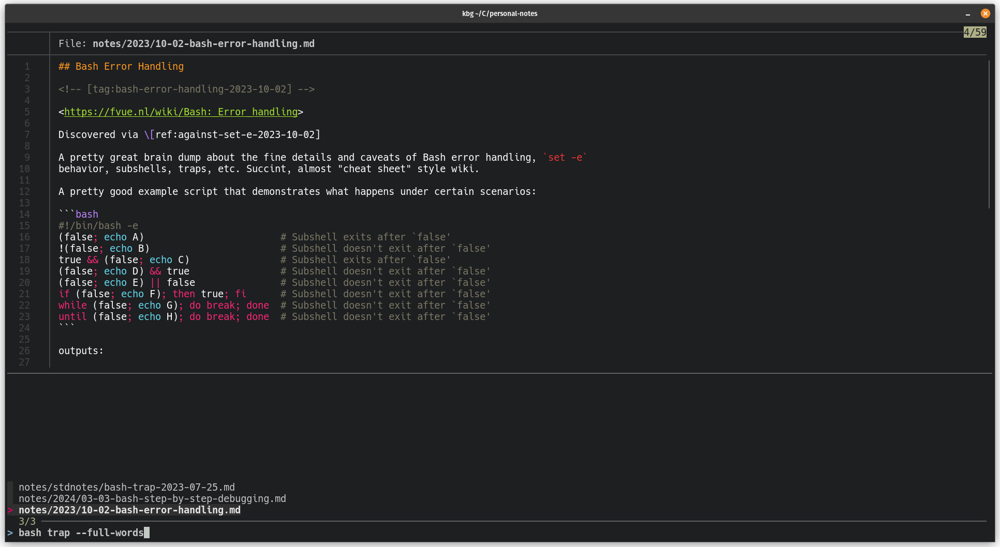

## kbgrep

Knowledgebase grep: A search tool optimized for knowledgebases

_Work in progress, but currently usable._

I maintain a personal knowledgebase as a collection of markdown files. As of this writing, I'm up to
2500 files.

I have yet to encounter a good terminal-based search tool for knowledgebases. `grep` and friends are
wonderful for things like code, config files, etc., however the UX gets _really_ bad _really_ fast
when I start to search a knowledgebase. The reason is because for knowledgebases, I am often
looking for a file that has "search term A" and "search term B" _somewhere_ in the same file, but
they're probably not anywhere near each other.

kbgrep is a bash script that creates a much more ergonomic search experience, using ripgrep, fzf,
and bat underneath.

### dependencies

* [ripgrep](https://github.com/BurntSushi/ripgrep)
* [fzf](https://github.com/junegunn/fzf)
* [bat](https://github.com/sharkdp/bat)

### installation

If you've installed the dependencies, just
[download the kbg script](https://github.com/pcrockett/kbgrep/releases/latest/download/kbg),
`chmod +x`, and run it.

### usage

The best way to use it is interactively. Just run it without parameters:

```bash
kbg
```

* Type in your search terms and watch the list of files update as you type.
* Use Ctrl+D to preview a file
* Hit enter to open the file in your `$EDITOR`

In interactive mode, you are not only able to search for _terms_ but also supply _CLI arguments_ as
well.



Some examples of how to use CLI arguments:

```bash
# search for files mentioning both "mac address" and "linux" in the same file
kbg "mac address" linux

# look for files that remind you how to use `trap` statements in bash.
# and then open them in your $EDITOR.
kbg --edit bash trap  # note: in interactive mode, `--edit` is treated as a search term

# find all files that mention "shell" or "bash" scripting in some way
kbg --any bash shell

# kbgrep is composable -- you can refine your search results using a pipeline.
# look for that one shell script (or was it specifically "bash"?) that you
# wrote a long time ago that changed your mac address.
kbg "mac address" | kbg --any bash shell
```

Output of `kbg --help`:

```plaintext
kbg - Knowledgebase grep: A search tool optimized for knowledgebases

Usage:
  kbg [OPTIONS] [--] [TERMS...]
  kbg --help | -h
  kbg --version | -v

Options:
  --type, -t FILE_TYPE
    File type as defined by `rg --type-list`

  --any, -a
    Return files that contain at least one term

  --full-words, -w
    Search for full words

  --edit, -e
    Edit search results in your $EDITOR

  --help, -h
    Show this help

  --version, -v
    Show version number

Arguments:
  TERMS...
    Terms to search for

Examples:

  # Interactive search UI
  kbg

  # Search for markdown files that contain BOTH terms "foo" and "bar"
  # Edit search results with $EDITOR
  kbg --type markdown --edit foo bar

  # Search for markdown files containing EITHER "bash" OR "shell"
  # Narrow down search results containing the phrase "mac address"
  # Edit search results with $EDITOR
  kbg --type markdown --any bash shell \
    | kbg --edit "mac address"
```
